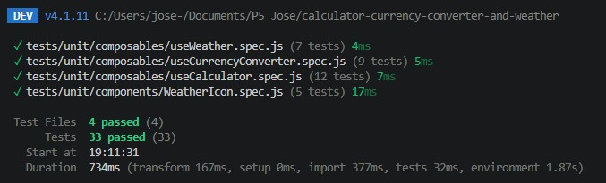
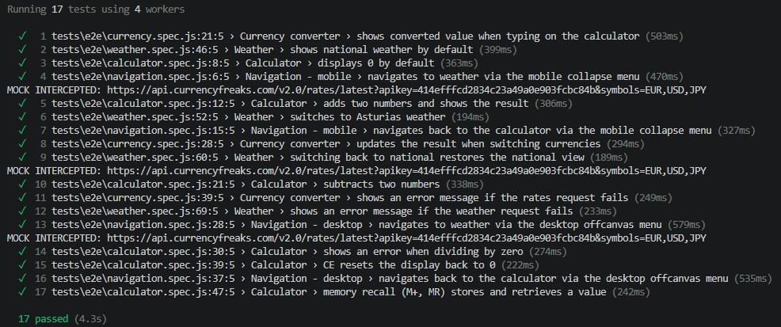

# Calculadora multifuncional

> Crear una calculadora multifuncional con el framework VUE que incluya: calculadora que realice las operaciones básicas, conversor de divisas (euro, yen y dólar) y un apartado del tiempo.

## Tecnologías

Este proyecto se ha desarrollado con las siguientes tecnologías:
- Vue 3 (Composition API + `<script setup>`)
- Bootstrap 5
- Bootstrap Icons
- Vue Router
- Pinia
- Axios
- Vitest (`tests unitarios`)
- Playwright (`tests e2e`)

---

## Calculadora

### Requisitos:
- Realizará las operaciones básicas
    - Suma
    - Resta
    - Multiplicación
    - División
- Teclas obligatorias:
    - Numéricas del 0 al 9
    - Suma, resta, multiplicación, división
    - Signo `igual`
    - Signo `.` para la coma
    - CE para el reseteo
- Control de errores
- Teclas extras:
    - M+ para poner en memoria el número actual. Se habrá de usar Pinia para almacenar la información
    - MR para recuperar el número en memoria
    - MC para borrar los datos guardados en memoria

### Desarrollo

Al principio planteé la calculadora como una única vista (`CalculatorView.vue`) que contenía tanto el estado como todo el marcado de los botones. Funcionaba, pero en cuanto añadí el conversor de divisas me di cuenta de un problema: el conversor necesitaba leer el mismo valor que se mostraba en la pantalla de la calculadora para poder convertirlo al vuelo, y ese valor vivía encerrado dentro del componente de la calculadora, inaccesible desde fuera.

Por eso separé la lógica en tres capas:

| Capa | Archivo | Responsabilidad |
| --- | --- | --- |
| Composable | `composables/useCalculator.js` | Estado (`display`, operador actual, valor previo) y toda la lógica de cálculo |
| Componente | `components/Calculator/Calculator.vue` | Solo el marcado de los botones; no conoce la lógica, únicamente emite eventos (`@number`, `@operator`, `@equals`...) |
| Vista | `views/CalculatorView.vue` | Instancia `useCalculator()` una única vez y reparte el estado como *props* tanto a `Calculator.vue` como a `Currency.vue` |

De esta forma, `display` es una única referencia reactiva compartida: cuando se pulsa un número, la calculadora se actualiza y el conversor de divisas ve el cambio en el mismo instante, sin duplicar estado ni arriesgarse a que ambos se desincronicen.

El control de errores cubre la división entre cero y cualquier resultado no finito (`Infinity`, `NaN`), mostrando `"Error"` en la pantalla y bloqueando cualquier tecla salvo `CE` hasta que se resetea.

Para la memoria (`M+`, `MR`, `MC`) se usa un store de Pinia (`stores/memory.js`) en lugar de una variable local del composable, ya que de esta forma el valor en memoria sobrevive aunque el usuario cambie de vista (por ejemplo, yendo a "El tiempo" y volviendo a la calculadora).

---

## Conversor de divisas

### Requisitos:
- Deberá estar integrado en la calculadora
- Divisas a utilizar: `euro (€)`, `dólar ($)` y `yen (¥)`
- Se deberá utilizar la siguiente API: [currencyfreaks.com](https://currencyfreaks.com/)

### Desarrollo

Siguiendo la misma separación de capas que en la calculadora:

| Capa | Archivo | Responsabilidad |
| --- | --- | --- |
| Servicio | `services/currencyApi.js` | Llamada a la API de currencyfreaks vía Axios |
| Composable | `composables/useCurrencyConverter.js` | Estado (`rates`, `loading`, `error`) y la función `convert()` |
| Componente | `components/Calculator/Currency.vue` | Selectores de divisa origen/destino y resultado |

La clave de la API se guarda en un archivo `.env` (variable `VITE_CURRENCYFREAKS_API_KEY`) y nunca se sube al repositorio, siguiendo la convención de Vite de exponer al cliente únicamente las variables prefijadas con `VITE_`.

El componente recibe el valor `display` de la calculadora como *prop* de solo lectura: no lo modifica, simplemente lo transforma según la tasa de cambio actual. Esto es lo que satisface el requisito de "estar integrado en la calculadora" sin necesidad de duplicar el teclado numérico ni mantener dos estados independientes.

Un detalle que tuve que resolver: la tasa que devuelve currencyfreaks usa el dólar como base por defecto, así que `convert()` primero pasa el importe a dólares y después a la divisa destino, en lugar de asumir una conversión directa entre dos divisas cualesquiera.

---

## El tiempo

### Requisitos:
- Se deberá utilizar la siguiente API: [el-tiempo.net/api](https://www.el-tiempo.net/api)
- Mostrar una imagen en función del `stateSky`
- Se puede elegir entre la información nacional o de una provincia (Asturias)

### Desarrollo

La documentación pública de la API no detalla los valores exactos que puede tomar `stateSky`, así que antes de escribir ningún código inspeccioné la respuesta real con Postman contra los endpoints:

- Nacional: `https://api.el-tiempo.net/json/v3/general`
- Provincia (Asturias, código `33`): `https://api.el-tiempo.net/json/v3/provincias/33`
Descubrí que `stateSky` no es una cadena de texto simple, sino un objeto anidado dentro de cada ciudad del array `ciudades`:

```json
"stateSky": {
  "description": "Muy nuboso",
  "id": "15"
}
```

El campo `id` corresponde a la codificación estándar de estado del cielo de AEMET, por lo que decidí mapear los iconos por `id` en lugar de por `description`, ya que el primero es un código estable y el segundo es texto libre en español que podría variar ligeramente.

| Capa | Archivo | Responsabilidad |
| --- | --- | --- |
| Servicio | `services/weatherApi.js` | Llamadas a `/general` y `/provincias/:codProv` vía Axios |
| Composable | `composables/useWeather.js` | Estado (`weatherData`, `scope`) y la función `setScope()` para alternar entre nacional y Asturias |
| Componente | `components/Weather/WeatherIcon.vue` | Traduce el `id` de `stateSky` a un icono de Bootstrap Icons |
| Vista | `views/WeatherView.vue` | Selector de ámbito (nacional/Asturias) y listado de tarjetas por ciudad |

Al usar Bootstrap Icons en lugar de imágenes propias, no hace falta gestionar ni alojar ningún archivo `.svg` o `.png`: el icono es simplemente una clase CSS (`<i class="bi bi-cloud-rain-fill">`), lo cual encaja bien con el resto del proyecto, que ya usa Bootstrap como sistema de diseño.

---

## Tests

El proyecto cuenta con dos niveles de testing: **unitarios** con Vitest y **end-to-end (e2e)** con Playwright, cada uno viviendo en su propia carpeta al margen del código fuente:

```
tests/
├── unit/
│   ├── composables/
│   │   ├── useCalculator.spec.js
│   │   ├── useCurrencyConverter.spec.js
│   │   └── useWeather.spec.js
│   └── components/
│       └── WeatherIcon.spec.js
└── e2e/
    ├── calculator.spec.js
    ├── navigation.spec.js
    ├── currency.spec.js
    └── weather.spec.js
```

Decidí separarlos en `tests/` en lugar de dejarlos junto a cada archivo dentro de `src/`, ya que Playwright necesita su propio `testDir` claramente diferenciado del de Vitest —ambas herramientas entienden formatos de test distintos y no deben pisarse entre sí—, y esto además mantiene `src/` limpio de cualquier archivo que no sea código de la aplicación.

### Tests unitarios (Vitest)

Cada composable se testea de forma aislada, mockeando la capa de `services/` con `vi.mock()` cuando hace falta (`useCurrencyConverter`, `useWeather`), de forma que ningún test dependa de una llamada de red real ni de que la API externa esté disponible en el momento de ejecutar los tests.

| Archivo testeado | Qué se cubre |
| --- | --- |
| `useCalculator.js` | Operaciones básicas, decimales, control de errores (división entre cero, resultados no finitos), reseteo con CE |
| `useCurrencyConverter.js` | Carga de tasas, estado de `loading`/`error`, conversión usando el dólar como base |
| `useWeather.js` | Cambio de ámbito (nacional/Asturias), llamada al endpoint correcto según el ámbito, estado de `loading`/`error` |
| `WeatherIcon.vue` | Mapeo correcto de `stateSky.id` al icono de Bootstrap Icons correspondiente, e icono de respaldo (`bi-question-circle`) cuando el id no se reconoce o no llega ningún dato |

Para poder testear el store de memoria de Pinia sin necesidad de montar toda la aplicación, cada test crea su propia instancia con `setActivePinia(createPinia())` en un `beforeEach`, evitando que el estado de un test contamine el siguiente.

### Tests end-to-end (Playwright)

Los tests e2e arrancan un navegador real contra la aplicación completa (Playwright se encarga de levantar `npm run dev` automáticamente gracias a la opción `webServer` de su configuración) y simulan el flujo tal y como lo haría una persona usando la calculadora.

| Archivo | Qué se cubre |
| --- | --- |
| `calculator.spec.js` | Flujo completo de operaciones, división entre cero, botón CE, memoria (M+ / MR) |
| `navigation.spec.js` | Navegación entre Calculadora y El tiempo, tanto en el menú colapsable de móvil como en el *offcanvas* de escritorio |
| `currency.spec.js` | Actualización del resultado de conversión al escribir en la calculadora y al cambiar de divisa |
| `weather.spec.js` | Cambio entre ámbito nacional y Asturias, y mensaje de error si la petición falla |

En los tests de divisas y del tiempo, las llamadas a las APIs externas (`currencyfreaks` y `el-tiempo.net`) se interceptan con `page.route()` y se sustituyen por una respuesta simulada. Esto evita que los tests dependan de la clave de API real, de la disponibilidad de esos servicios en el momento de ejecutar los tests, o de que las divisas y el tiempo tengan siempre los mismos valores (algo que haría los tests poco fiables si se comparasen contra datos reales que cambian constantemente).

Un problema que me encontré durante el desarrollo: en un momento dado, un test de conversión de divisas pasaba, pero con un resultado que no encajaba con las tasas simuladas, lo cual apuntaba a que la petición mockeada no se estaba interceptando y la aplicación estaba golpeando la API real. Añadir un `console.log` dentro del handler de `page.route()` fue la forma más rápida de confirmar si la interceptación realmente se estaba disparando antes de asumir cualquier otro fallo más complejo (CORS, timing, etc.).

Para añadir identificadores estables a elementos que solo tenían clases de estilo de Bootstrap (sin ningún atributo único), se usó el atributo `data-testid` en los puntos clave que los tests necesitaban localizar (la pantalla de la calculadora, los selectores de divisa, el selector de ámbito del tiempo), en lugar de depender de clases CSS que podrían cambiar por motivos puramente visuales.

### Capturas de pantalla

| Tests unitarios | Tests e2e |
| --- | --- |
|  |  |
 
---
 
## Arquitectura general
 
El proyecto sigue una separación consistente en las tres funcionalidades:
 
- **`views/`** — una vista por ruta (`CalculatorView.vue`, `WeatherView.vue`), registradas en `router/index.js` con Vue Router.
- **`components/`** — piezas de interfaz reutilizables sin lógica de negocio propia (`Calculator.vue`, `Currency.vue`, `WeatherIcon.vue`).
- **`composables/`** — estado y lógica reactiva, independientes de cualquier componente concreto.
- **`services/`** — llamadas HTTP puras con Axios, sin nada de Vue, lo que las hace fáciles de aislar si en el futuro se añaden tests.
- **`stores/`** — estado global con Pinia (por ahora, únicamente la memoria de la calculadora).
`Header.vue` contiene la barra de navegación (con versión de menú colapsable en móvil y *offcanvas* en escritorio) que permite moverse entre la Calculadora y El tiempo.